# Lumen

Lumen is a fast, private, universal search app for Android. One search field finds your apps, contacts, files, calendar events, notes, and device settings, and answers quick questions as you type.

## Features

- **Universal search** across apps and app shortcuts, contacts, calendar events, documents and media, notes, and system settings.
- **Instant answers** from a built-in calculator, unit converter, currency converter, and world clock.
- **AI answers** from Google Gemini, using your own API key. Type `ai` followed by a question.
- **Notes** that become searchable as soon as you write them.
- **Available everywhere** through home screen widgets, a Quick Settings tile, the assistant gesture, and an optional launcher mode.
- **Material 3 Expressive design** with wallpaper-based or custom color palettes, light and dark themes, and a pure black option.
- **Private by design.** On-device search, no accounts, no analytics, and no advertising.

## Screenshots

### Search and Instant Answers

<table>
  <tr>
    <td align="center">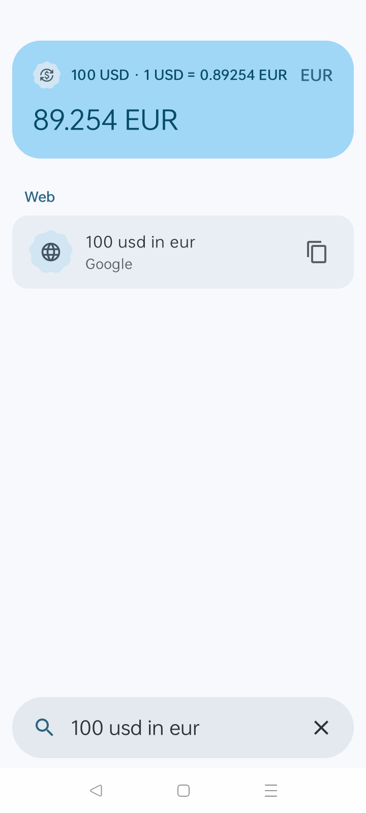<br><sub>Currency conversion</sub></td>
    <td align="center">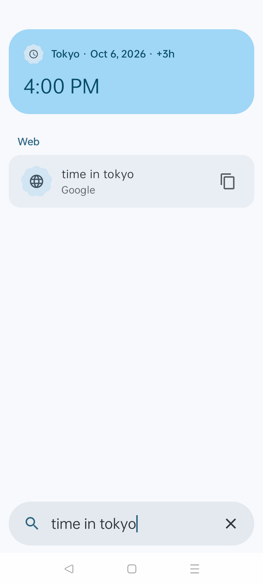<br><sub>World clock</sub></td>
    <td align="center">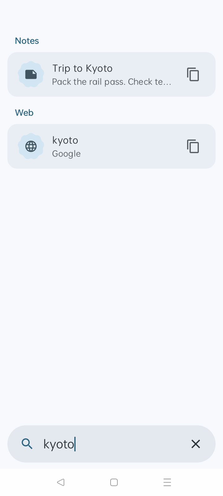<br><sub>Note search</sub></td>
  </tr>
</table>

### Notes

<table>
  <tr>
    <td align="center">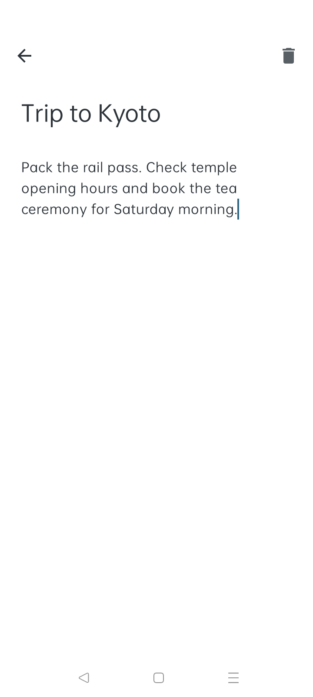<br><sub>Note editor</sub></td>
  </tr>
</table>

### Settings and Personalization

<table>
  <tr>
    <td align="center">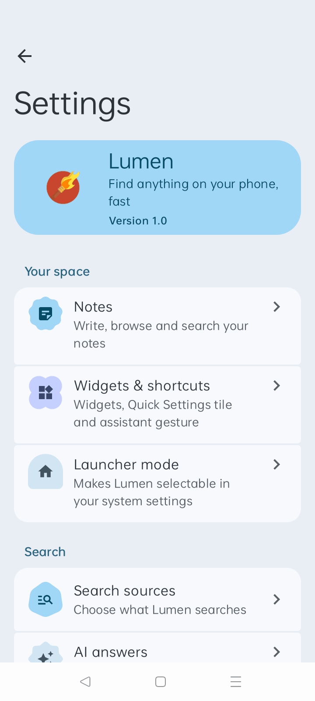<br><sub>Settings</sub></td>
    <td align="center">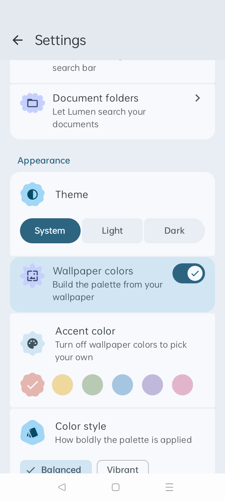<br><sub>Appearance</sub></td>
    <td align="center">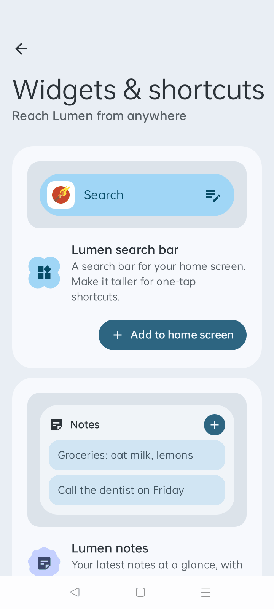<br><sub>Widgets and shortcuts</sub></td>
  </tr>
</table>
<table>
  <tr>
    <td align="center">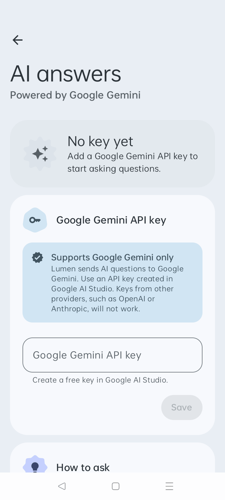<br><sub>AI answers</sub></td>
  </tr>
</table>

### Dark Theme

<table>
  <tr>
    <td align="center">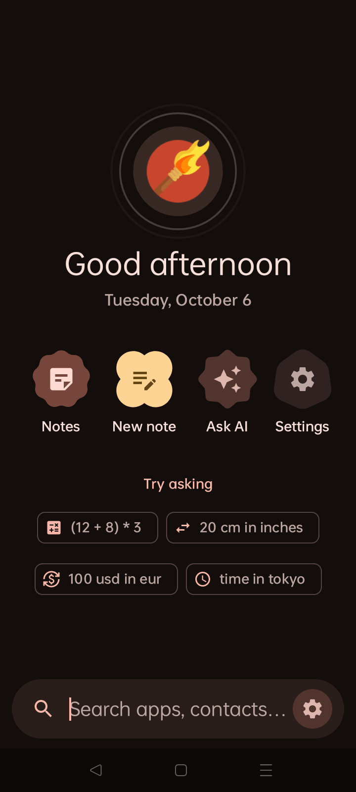<br><sub>Home</sub></td>
    <td align="center">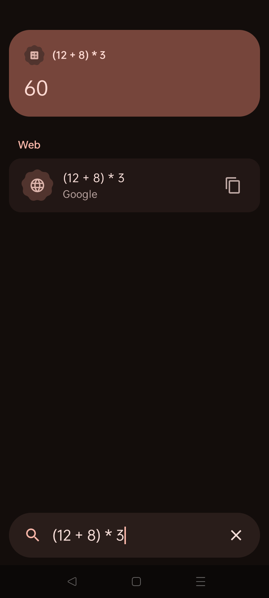<br><sub>Instant answer</sub></td>
    <td align="center">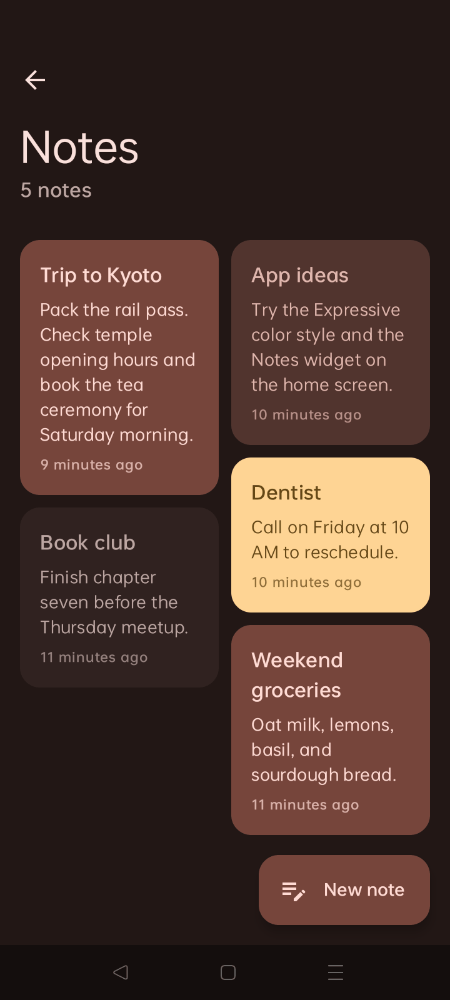<br><sub>Notes</sub></td>
  </tr>
</table>

## Requirements

- Android 11 (API level 30) or later
- To build from source: JDK 25 (see `mise.toml`) and the Android SDK with API level 37

## Building

```bash
./gradlew assembleDebug        # Build a debug APK
./gradlew installDebug         # Install on a connected device
./gradlew testDebugUnitTest    # Run unit tests
./gradlew assembleRelease      # Build a release APK
```

The About, Credits, Terms and Conditions, Privacy Policy, and License documents in this repository are bundled into the app at build time by the `bundleDocuments` Gradle task, so the in-app versions always match the repository.

## Architecture

Lumen is a single-module Kotlin app built with Jetpack Compose, Navigation 3, Koin, Room, DataStore, Ktor, and Glance. Packages follow Clean Architecture layers (`core/domain`, `core/data`, `core/platform`, `core/ui`, `feature`, `provider`, `surface`, `app`), and an architecture test enforces the dependency direction between them. Each search source is an independent `SearchProvider`, so adding a source never changes the search engine.

## Contributing

Bug reports and feature requests are welcome. Please open an issue at https://github.com/AbrarShakhi/Lumen/issues. If you find Lumen useful, consider giving the repository a star.

## Documents

- [About](docs/ABOUT.md)
- [Credits](docs/CREDITS.md)
- [Terms and Conditions](docs/TERMS.md)
- [Privacy Policy](docs/PRIVACY.md)
- [License](LICENSE)

## License

Copyright 2026 AbrarShakhi

Licensed under the Apache License, Version 2.0 (the "License"); you may not use this project except in compliance with the License. You may obtain a copy of the License at

    https://www.apache.org/licenses/LICENSE-2.0

Unless required by applicable law or agreed to in writing, software distributed under the License is distributed on an "AS IS" BASIS, WITHOUT WARRANTIES OR CONDITIONS OF ANY KIND, either express or implied. See the License for the specific language governing permissions and limitations under the License.
